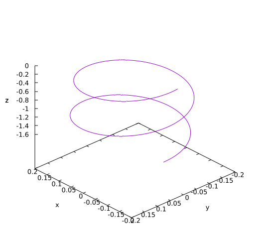

# `SOFE-2850U Assignment 1 Solutions`
---


# Question 1

The plot below illustrates two cycles of motion for 'Bob'. For full marks, you needed a compiling program and this plot. Part marks were given for simply modifying `VecR2` to `VecR3`.



# Question 2

The Euler algorithm is numerically unstable. It is particularly apparent for this sort of oscillatory motion. With the Euler algorithm, Bob's loops will get bigger and bigger and his energy will increase, violating the principle of conservation of Energy. Verlet on the other hand conserves energy and will be stable for this system of equations. 

# Question 3

The `VecR2<int>` type is *almost* a vector space. The problem is that the behaviour of signed-integer overflow is hardware dependent. That means that the type will not be closed under addition, violating the closure axiom for vector spaces. That means that I could have two vectors $a, b : \texttt{VecR2<int>}$, and under vector addition $a + b$ might not be something reliably in the `VecR2<int>` type.

In contrast, for unsigned integers, overflow results in modulo arithmetic. That means that when we count over the maximum `uint`, we start back at zero:  
```
  UINT_MAX + 1 == 0
  UINT_MAX + 2 == 1
  UINT_MAX + 3 == 2
```
which gives closure under addition. So the monoid $(\mathtt{uint}, +)$ is closed, and that means we can form a vector space over `unit`s. That is, `VecR2<uint>` is a vector space.

# Question 4

Expand the recursion and simplify:
```
  L<T> = 1 + T * L<T>
       = 1 + T * (1 + T * L<T>)
       = 1 + T * (1 + T * (1 + T * L<T>))
       = 1 + T * (1 + T * (1 + T * (1 + T * L<T>)))
       = 1 + T + T^2 + T^3 + T^4 + …
```
Remembering that `1` is just the unit type, `+` is the tagged union and can be read as 'OR', and `*` is the Cartesian product, and can be read as 'AND', we can expand this in English:

> `Unit` OR a `T` OR a pair of `T`s OR a triple of `T`s OR a 4-tuple of `T`s OR …

So, this type is either a null type, or an arbitrarily large homogeneous tuple. In other words, this is either a ***list*** of `Ts` or an empty list.